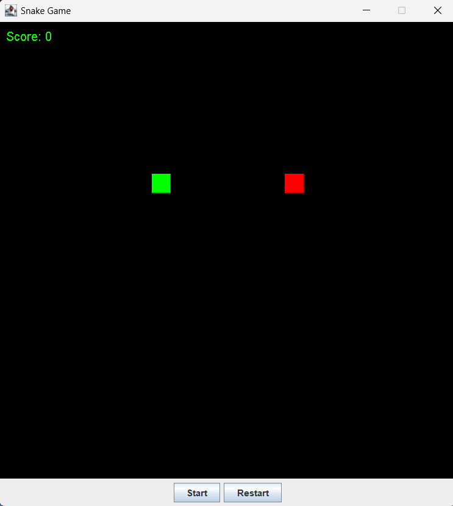
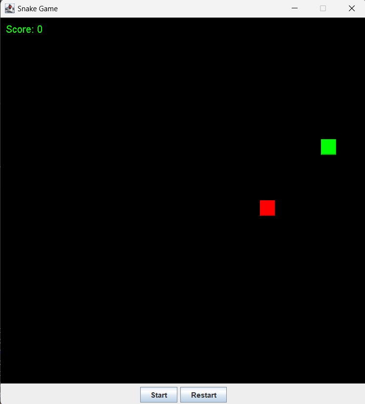
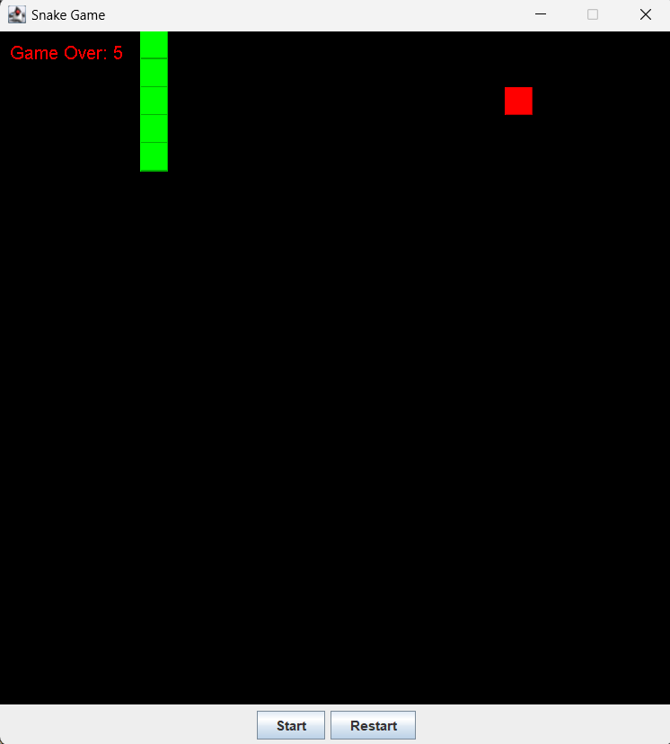

Overview
Welcome to the Snake Game! This Java-based application provides a classic snake game experience with a simple graphical user interface.

Requirements
Java Development Kit (JDK) 8 or higher
Any modern IDE (e.g., IntelliJ IDEA, Eclipse) or a command-line interface
Features
Playable snake game with basic controls
Graphical interface with game display and control panel

How to Run
Running from an IDE
Clone this Repository
Find App.java 
Click run java

Snapshot

